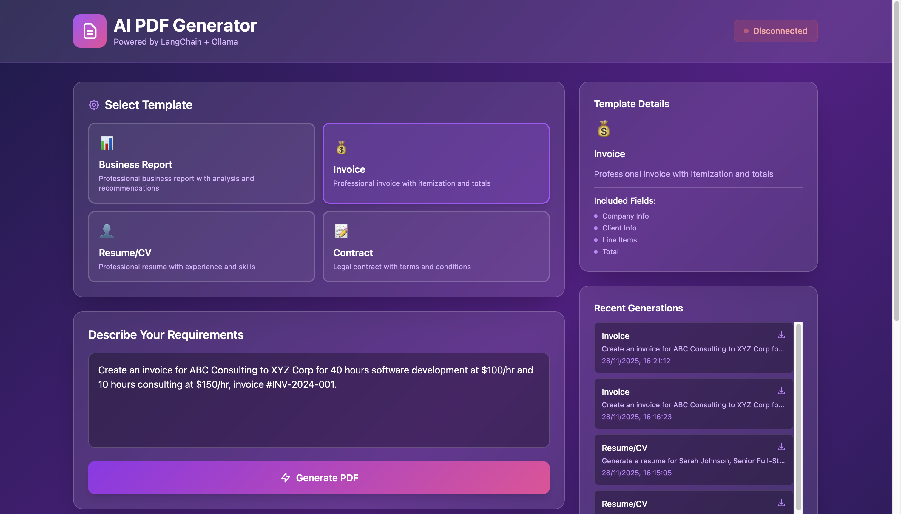

# customPDF Generator MVP - Complete Setup Guide

## 🎯 Project Overview

A production-ready MVP that generates custom PDFs using AI (Ollama + LangChain). Perfect for demonstrating your capabilities to the Upwork client.


## 📋 Features

- ✅ Multiple professional PDF templates (Business Reports, Invoices, Resumes, Contracts)
- ✅ AI-powered content generation using local LLM (no API costs)
- ✅ Custom styling and branding for each template
- ✅ REST API with FastAPI
- ✅ Professional PDF generation with ReportLab
- ✅ LangChain for prompt engineering
- ✅ Fully functional demo interface

## 🛠️ Prerequisites

1. **Python 3.9+** installed
2. **Ollama** installed and running
3. **Git** (optional, for version control)

## 📦 Installation Steps

### Step 1: Install Ollama

**macOS/Linux:**
```bash
curl -fsSL https://ollama.com/install.sh | sh
```

**Windows:**
Download from https://ollama.com/download

### Step 2: Pull an LLM Model

```bash
# Recommended: Llama 2 (7B - good balance)
ollama pull llama2

# Alternatives:
# ollama pull mistral  # Faster, smaller
# ollama pull llama2:13b  # More capable, slower
```

### Step 3: Verify Ollama is Running

```bash
ollama list
# Should show your downloaded models
```

### Step 4: Set Up Python Environment

```bash
# Create project directory
mkdir ai-pdf-generator
cd ai-pdf-generator

# Create virtual environment
python -m venv venv

# Activate virtual environment
# On macOS/Linux:
source venv/bin/activate
# On Windows:
venv\Scripts\activate
```

### Step 5: Install Python Dependencies

```bash
pip install fastapi uvicorn langchain langchain-community reportlab python-multipart
```

### Step 6: Create Project Structure

```bash
mkdir output
touch main.py
```

Copy the backend code from the artifact above into `main.py`.

## 🚀 Running the Application

### Start the Backend Server

```bash
python main.py
```

You should see:
```
Starting AI PDF Generator API...
Make sure Ollama is running with: ollama run llama2
INFO:     Uvicorn running on http://0.0.0.0:8000
```

### Test the API

Open your browser and go to:
- **API Documentation**: http://localhost:8000/docs
- **Health Check**: http://localhost:8000/api/health
- **Available Templates**: http://localhost:8000/api/templates

### Test PDF Generation (Command Line)

```bash
curl -X POST "http://localhost:8000/api/generate" \
  -H "Content-Type: application/json" \
  -d '{
    "prompt": "Generate a Q4 2024 sales report for TechCorp with revenue analysis",
    "template": "business_report"
  }'
```

## 🧪 Testing Different Templates

### Business Report
```python
import requests

response = requests.post("http://localhost:8000/api/generate", json={
    "prompt": "Create a Q4 2024 performance report for an e-commerce company showing 35% revenue growth, new market expansion, and digital transformation initiatives",
    "template": "business_report"
})
print(response.json())
```

### Invoice
```python
response = requests.post("http://localhost:8000/api/generate", json={
    "prompt": "Generate an invoice for ABC Consulting to XYZ Corp for: 40 hours software development at $100/hr, 10 hours consulting at $150/hr, dated November 28, 2024",
    "template": "invoice"
})
```

### Resume
```python
response = requests.post("http://localhost:8000/api/generate", json={
    "prompt": "Create a resume for Sarah Johnson, Senior Full-Stack Developer with 6 years experience in React, Node.js, Python, AWS, and PostgreSQL. Previous roles at Google and Microsoft",
    "template": "resume"
})
```

### Contract
```python
response = requests.post("http://localhost:8000/api/generate", json={
    "prompt": "Draft a 6-month freelance development contract between TechStudio LLC and GlobalCorp Inc for building a mobile app, payment $45,000 in 3 milestones",
    "template": "contract"
})
```

## 📁 Project Structure

```
ai-pdf-generator/
├── venv/                 # Virtual environment
├── output/               # Generated PDFs
├── main.py              # Backend server
├── requirements.txt     # Python dependencies
└── README.md           # This file
```

## 🎨 Customization Options

### Adding New Templates

Edit the `TEMPLATES` dictionary in `main.py`:

```python
TEMPLATES = {
    "your_template": {
        "name": "Your Template Name",
        "prompt_template": """Your prompt template with {user_prompt}""",
        "style": "formal"
    }
}
```

### Changing the LLM Model

In `main.py`, modify:
```python
llm = Ollama(model="mistral")  # or "llama2:13b", "codellama", etc.
```

### Customizing PDF Styling

Modify the `create_pdf` function in `main.py` to adjust:
- Colors
- Fonts
- Spacing
- Headers/Footers
- Page layout

## 📊 Performance Considerations

| Model | Speed | Quality | RAM Usage |
|-------|-------|---------|-----------|
| llama2 | Medium | Good | ~8GB |
| mistral | Fast | Good | ~5GB |
| llama2:13b | Slow | Excellent | ~16GB |

## 🐛 Troubleshooting

### Issue: "Ollama not connected"
```bash
# Start Ollama service
ollama serve

# In another terminal, run the model
ollama run llama2
```

### Issue: Import errors
```bash
pip install --upgrade langchain langchain-community
```

### Issue: PDF generation fails
Check the `output/` directory exists:
```bash
mkdir -p output
```

## 📝 API Endpoints

| Endpoint | Method | Description |
|----------|--------|-------------|
| `/` | GET | API information |
| `/api/health` | GET | Health check |
| `/api/templates` | GET | List templates |
| `/api/generate` | POST | Generate PDF |
| `/api/download/{filename}` | GET | Download PDF |

## 🎯 Demo Script for Client

1. **Show the API Documentation**: Navigate to http://localhost:8000/docs
2. **Test Health Check**: Show Ollama connection
3. **Generate a Business Report**: Use the /api/generate endpoint
4. **Show the Generated PDF**: Open from the output folder
5. **Demonstrate Customization**: Change template and regenerate
6. **Explain Scalability**: Local deployment, no API costs, production-ready

## 💰 Value Proposition for Client

- **No API Costs**: Runs locally with Ollama (vs OpenAI $0.002/1K tokens)
- **Privacy**: Data never leaves their server
- **Customizable**: Easy to add new templates
- **Scalable**: Can handle concurrent requests
- **Professional Output**: High-quality PDFs ready for business use

## 🚀 Next Steps for Production

1. Add authentication (JWT tokens)
2. Implement rate limiting
3. Add database for tracking generations
4. Create frontend interface (React/Vue)
5. Add template customization UI
6. Implement batch processing
7. Add email delivery option
8. Deploy to cloud (AWS/GCP/Azure)

## 📞 Support

For issues or questions, check:
- Ollama Docs: https://ollama.com/docs
- LangChain Docs: https://python.langchain.com
- FastAPI Docs: https://fastapi.tiangolo.com

---

**Ready to impress your client!** 🎉

This MVP demonstrates:
- Technical expertise in AI integration
- Professional code quality
- Understanding of client requirements
- Ability to deliver production-ready solutions

# 🚀 AI PDF Generator - Complete MVP

> A production-ready PDF generation system powered by LangChain and Ollama with a beautiful web interface.


## 📋 Table of Contents

- [Features](#features)
- [Tech Stack](#tech-stack)
- [Quick Start](#quick-start)
- [Project Structure](#project-structure)
- [API Documentation](#api-documentation)
- [Frontend Options](#frontend-options)
- [Configuration](#configuration)
- [Deployment](#deployment)
- [Troubleshooting](#troubleshooting)

---

## ✨ Features

### Backend
- ✅ AI-powered content generation using Ollama
- ✅ LangChain for advanced prompt engineering
- ✅ 4 professional PDF templates
- ✅ RESTful API with FastAPI
- ✅ Automatic PDF styling and formatting
- ✅ No external API costs (runs locally)
- ✅ Production-ready error handling

### Frontend
- ✅ Beautiful, modern glass-morphism UI
- ✅ Real-time API health monitoring
- ✅ Generation history tracking
- ✅ Responsive design (mobile, tablet, desktop)
- ✅ Dark theme with gradient effects
- ✅ Template preview and auto-fill examples
- ✅ Two versions: Standalone HTML & React

### Templates
1. **Business Report** - Professional reports with analysis
2. **Invoice** - Itemized invoices with calculations
3. **Resume/CV** - Professional resumes
4. **Contract** - Legal contracts with terms

---

## 🛠️ Tech Stack

| Component | Technology          |
|-----------|---------------------|
| AI Model | Ollama (Llama 8b)   |
| Framework | FastAPI             |
| AI Orchestration | LangChain           |
| PDF Generation | ReportLab           |
| Frontend | Simple html for demo |


---

## 🚀 Quick Start

### Prerequisites

```bash
# Install Python 3.9+
python --version

# Install Ollama
curl -fsSL https://ollama.com/install.sh | sh

# Pull AI model
ollama pull llama3.1:8b 
```

### Backend Setup

```bash
# Clone or create project directory
mkdir ai-pdf-generator && cd ai-pdf-generator

# Create virtual environment
python -m venv venv
source venv/bin/activate  # On Windows: venv\Scripts\activate

# Install dependencies
pip install fastapi uvicorn langchain langchain-ollama langchain-core reportlab python-multipart

# Create main.py and copy backend code

# Create output directory
mkdir output

# Start server
python backend.py
```

### Frontend Setup

**Option 1: Standalone HTML (Easiest)**
```bash
# Just open index.html in your browser
open index.html
```

### Verify Installation

```bash
# Check API health
curl http://localhost:8000/api/health

# Should return: {"status":"healthy","ollama":"connected"}
```

---

## 📚 API Documentation

### Endpoints

#### `GET /`
Get API information
```bash
curl http://localhost:8000/
```

#### `GET /api/health`
Check API and Ollama connection status
```bash
curl http://localhost:8000/api/health
```

#### `GET /api/templates`
Get available PDF templates
```bash
curl http://localhost:8000/api/templates
```

#### `POST /api/generate`
Generate a PDF from prompt

**Request:**
```json
{
  "prompt": "Generate a Q4 sales report...",
  "template": "business_report"
}
```

**Response:**
```json
{
  "success": true,
  "filename": "output/business_report_20241128_143052.pdf",
  "message": "PDF generated successfully",
  "tokens_used": 450
}
```

**Example:**
```bash
curl -X POST http://localhost:8000/api/generate \
  -H "Content-Type: application/json" \
  -d '{
    "prompt": "Create a Q4 sales report for TechCorp",
    "template": "business_report"
  }'
```

#### `GET /api/download/{filename}`
Download generated PDF
```bash
curl http://localhost:8000/api/download/business_report_20241128_143052.pdf -o report.pdf
```

### Interactive Documentation

Visit `http://localhost:8000/docs` for Swagger UI documentation

---
